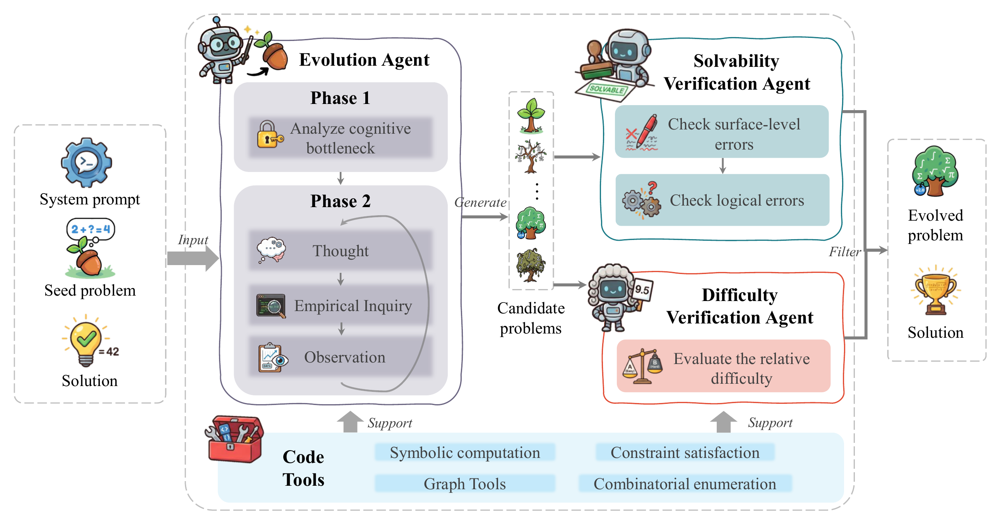
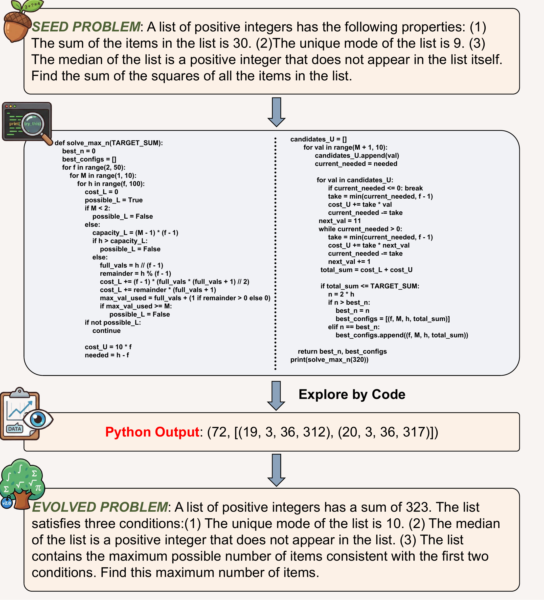

# Code2Math

**Can Your Code Agent Effectively Evolve Math Problems Through Exploration?**

[](https://arxiv.org/abs/2603.03202)
[](LICENSE)



Code2Math is a code-agent framework for evolving high-difficulty mathematical problems through executable exploration. The system starts from seed problems, asks a code-capable evolution agent to create harder variants, then filters candidates with solvability and difficulty verification agents.

## Paper

**Code2Math: Can Your Code Agent Effectively Evolve Math Problems Through Exploration?**  
[arXiv:2603.03202](https://arxiv.org/abs/2603.03202)

## Authors

Dadi Guo*, Yuejin Xie*, Qingyu Liu*, Weixian Huang*, Jiayu Liu, Zhiyuan Fan, Qihan Ren, Shuai Shao, Tianyi Zhou, Jianjie Feng, Wenze Su, Yujiu Yang, Dongrui Liu (corresponding author), Yi R. (May) Fung (corresponding author)

*Equal contribution.

**Affiliations:** Hong Kong University of Science and Technology, Tsinghua University, Zhejiang University, Nanjing Tech University, Shanghai Jiao Tong University, University of Michigan, Independent Researcher.

## What Is Included

- `original_problems.json` - 100 seed math problems.
- `evolved_problems/` - evolved problem sets from the main model runs.
- `math_demonstrations/` - few-shot demonstrations grouped by math category.
- `prompts/prompt_math.py` - prompt templates for evolution, verification, solving, and evaluation.
- `code2math/` - reusable Python package for the full code-agent pipelines.
- `scripts/` - command-line entry points for running the two full pipelines.

## Full Code-Agent Pipelines

Both released pipelines use the same three-stage workflow:

1. `ProblemEvolver` creates a harder variant of a seed problem.
2. `SolvabilityVerifier` checks that the evolved problem is well-formed and solvable.
3. `DifficultyVerifier` checks that the new problem meaningfully increases the burden of discovery.

### Standard CodeAgent Backend

```bash
python scripts/run_code_agent_pipeline.py --max-workers 5
```

This backend uses the standard `smolagents.CodeAgent` execution model with authorized Python imports for symbolic computation, search, graph algorithms, combinatorial enumeration, and numerical exploration.

### Interleaved-Thinking Backend

```bash
python scripts/run_interleaved_pipeline.py --max-workers 5
```

This backend keeps an OpenAI-style `messages + tool_calls + tool responses` loop and writes full trajectories to `messages.json`. It preserves reasoning content when the model provider returns it, making thinking-model runs easier to inspect.

The interleaved backend is implemented in this repository as a small compatibility layer; users do not need to install a patched `smolagents` fork.

## Example



## Setup

```bash
python -m venv .venv
source .venv/bin/activate  # Windows: .venv\Scripts\activate
pip install -r requirements.txt
cp .env.example .env
```

Edit `.env` with your model endpoint and API key:

```dotenv
URL=https://your-openai-compatible-endpoint/v1
KEY=your_api_key
EVOLVE_MODEL=your-evolver-model
VERIFY_MODEL=your-verifier-model
```

Qwen-style Basic-auth endpoints are also supported through `API_AK`, `API_SK`, `QWEN_THINKING_URL`, and `QWEN_INSTRUCT_URL`.

## Output

By default, results are written under:

```text
adapted_problems/
  codeagent/
  interleaved/
```

Agent logs are written under `logs/`. These generated outputs are intentionally ignored by git.

Each result entry records the pipeline status, failure stage if any, evolved problem, verifier outputs, and final difficulty judgment.

## Data Format

Seed problems use:

```json
{
  "problem_description": "...",
  "solution_steps": "...",
  "answer": "..."
}
```

Evolved problem records contain:

```json
{
  "status": "success",
  "result_data": {
    "status": true,
    "new_problem": {
      "new_problem": "...",
      "new_solution_steps": "...",
      "new_answer": "..."
    },
    "solvability_verifier_output": {},
    "difficulty_verifier_output": {}
  }
}
```

## Notes

- Do not commit `.env`, logs, or generated run outputs.
- The single-turn no-code pipeline used in later experiments is not part of this open-source package; this release focuses on the two full code-agent workflows.
- The prompts and demonstrations are included so runs can be reproduced or adapted with other OpenAI-compatible model providers.

## Citation

If you use Code2Math data, prompts, or code, please cite:

```bibtex
@misc{guo2026code2mathcodeagenteffectively,
      title={Code2Math: Can Your Code Agent Effectively Evolve Math Problems Through Exploration?},
      author={Dadi Guo and Yuejin Xie and Qingyu Liu and Weixian Huang and Jiayu Liu and Zhiyuan Fan and Qihan Ren and Shuai Shao and Tianyi Zhou and Jianjie Feng and Wenze Su and Yujiu Yang and Dongrui Liu and Yi R. Fung},
      year={2026},
      eprint={2603.03202},
      archivePrefix={arXiv},
      primaryClass={cs.CL},
      url={https://arxiv.org/abs/2603.03202},
}
```

## License

MIT License. See [LICENSE](LICENSE).
